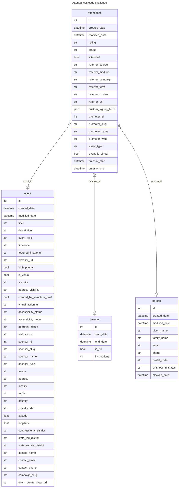

## What I did

### Data exploration

**Note**: I like to do data exploration before diving in. As it turns out, everything I found is explained clearly in the API doc, but it still felt worthwhile to me. These are my notes on that process for completeness.

Looks like `person` includes both a `person_id` and an `id` field. Spot checks indicate that they're identical, but I want to verify, since it seems like a candidate unique id.

```
    >>> id_matches = [ x['person']['person_id'] == x['person']['id'] for x in attendances ]
    >>> id_matches.count(True)
    3259
    >>> id_matches.count(False)
    0
```

Great! A double-check on the API documentation verifies that we should be using `id`, as `person_id` will be deprecated. Neither `event` nor `timeslot` have this double-id problem, so we're good on that front.

But we're not out of the woods on data duplication yet. Notably, each `attendance` has a `sponsor` and an `event`, and the `event` also has a `sponsor`. I want to check to see if they're always referring to the same sponsor.

```
    >>> sponsor_matches = [ x['sponsor']['id'] == x['event']['sponsor']['id'] for x in attendances ]
    Traceback (most recent call last):
      File "<stdin>", line 1, in <module>
      File "<stdin>", line 1, in <listcomp>
    TypeError: 'NoneType' object is not subscriptable
```

Okay, so in at least one case, one of the `sponsor`s does not exist.


```python
    odd_atts = []
    for att in attendances:
      (in_att, in_ev, matching) = (False, False, False)
      if 'sponsor' in att and att['sponsor'] != None and 'id' in att['sponsor']:
        in_att = True
      if 'sponsor' in att['event'] and att['event']['sponsor'] != None and 'id' in att['event']['sponsor']:
        in_ev = True
      if in_att and in_ev:
        matching = att['sponsor']['id'] == att['event']['sponsor']['id']
      if False in [in_att, in_ev, matching]:
        odd_atts.append((att['id'], in_att, in_ev, matching))
```

Looking at `odd_atts`, it turns out that there's no clear canonical field, though there is a pattern. If the `attendance` does not have its own attendance `id`, then the `event`'s `sponsor` may not be complete, but the `attendance`'s should be. If the `attendance` has its own `id`, that reverses: the `event`'s `sponsor` should be complete and have its `sponsor` `id`, but the `attendance` might not.

There is one exception. Attendance id 7173825 has *conflicting* sponsor ids.

The API documentation has explanations. The lack of `attendance` `id`s happens when the requestor (WFP, I assume, in this case) is independent, but the event organizer is not. That also impacts how much of the event and person data we have access to. Finally, the top-level `sponsor` can be a different org if that org promoted the event to the attendee.

### Data design

From the problem statement, we're expecting four tables' worth of information: events, time slots, people, and the attendances themselves. There are more entities than that in the data (notably Organizations), but if we end up needing those we can deal with that at a later date.

Attendances make a pretty clear candidate for a fact table in a star schema, so let's start with that and make the other tables dimensions. There is also a link between the `event` and `timeslot` tables, but none of the test data makes use of that, so I'm ignoring it for now.

So it seems pretty straightforward. I'll make a few changes from what's delivered in the json:

  1. Collapsing some values upward (e.g. `event->location->venue` becomes `event->venue`)
  2. Ignoring some data (notably most of the sponsor data). If we need it in the future we can deal with it then, ideally adding an organization table at that point.
  3. Converting embeds to references where appropriate--this is a core part of the exercise.
  4. Some datatype conversions. These include:
      - unix timestamps to datetimes, for easier querying
      - enums to strings, since the API doc acknowledges at least some of these may change over time. Since we have a single source for the data, this is safe for now. We should revisit if we're adding sources for these tables.
      - collapsing arrays. In every case in the test data, arrays (`tags`, `address_lines`, `phone_numbers`, etc) are either empty, or include only one relevant piece of information.

There are a couple more complicated changes, though. Because of permissioning, we sometimes get largely-empty payloads for `event` and `timeslot` data. Importantly, neither has an `id`, which make them ill-suited for a dimension table. I have two options:

  1. Create, track, and use my own set of `id`s. If I had more time, I might end up doing this, just to ensure data is as complete as it can be. It ups the complexity significantly, though, and, since we need to keep track of the API `id` for future loads, the data model could be easily misread and lead to problems with future data analysis.
  2. Try and capture at least some of the relevant data in other entities. This is a violation of normalization, though we're already in star schema territory so I'm not overly concerned about that. Conveniently, the data returned in those situations is smaller than the normal payload, so pulling it up doesn't bloat our `attendance` table overly.

I went with the latter option for this exercise.


### Writing the code

I opted to keep things simple, though verbose. No libraries outside of python standard are used.

Instead of modifying the json objects in-place, I opted to build new entities. There are two reasons for this.

First, future-proofing. If the endpoint starts providing additional data, that could destabilize our csv format.  If the endpoint starts providing additional *structured* data (i.e.  another nested dict), that will start throwing errors. Building the output allows for some changes in input while keeping our output stable and predictable.

The other benefit, not to be discounted, is that the original attendance json object remains immutable, guaranteeing that, for example, parsing out the event data will not have hidden impact on parsing out the timeslot data later.

The cost is additional RAM usage, which may be an issue depending on data size and where we run this, but for a 16M file, it'll run fine on any modern potato.

I haven't profiled it properly, but it runs in about a half-second on my four-year-old laptop.


## What I Didn't Do (or Would Do Differently)

One thing that I find very important that I wasn't able to get to is verifying consistency in referenced objects. For example, Person `608531` has 20 attendances in this data set, but at no point did I verify that they had the same first/last/email/etc as each other.

Because my priority was de-duping, I simply recorded the first instance of `608531` that I ran into. If they are all identical, this isn't an issue. But if they're time-captured entities (for example), then I might need to keep all of them (or at least all distinct versions). Alternately, I might want to capture only the one with the highest `modified_date`. Either way, it would need to be addressed.

There are also some more data oddities that remain unexplained. The `status` of an attendance, for example, is sometimes null, corresponding with null `event_id`s. That's unmentioned in the API docs, so I'd want to spend some time verifying that relationship, and working with our analysts on options for handling status in those cases.

The example data for this exercise is limited to a single sponsor, with only one attendance having a different organizer. That said, Organizations seem to be an important part of his API's data model, so I would want to discuss making them available, as well.

Finally, though I stand by simple and verbose, the code I wrote is verbose in a way that's difficult to automatically verify. Notably, lots of strings that *need* to be identical for things to work properly, but represented as separate literals (often in the simple form of `dict1['astring'] = dict2['asting']`). Any typo (like the one in the last parenthetical) means bad data, and bad data is often worse than no data.

If I picked this code back up again, I'd try to DRY my strings, ideally through some mapping that can be used by a more generic 'build this entity from this other entity' function.


## What You Should Do

There are postgres table definitions in `data/tables.sql` that will happily take data from the generated csvs. Alternately, with two small changes, the script can generate csvs that should load into BigQuery (**n.b.** this has not been tested).

Once there, you should have tables that look like:



The example queries can be accomplished by queries against a single table: `attendance`. Beyond that, though, the tables are in a straightforward star schema with `attendance` as the fact table, and the others as dimension tables (referenced from `event_id`, `person_id`, and `timeslot_id`).

For the specific examples:

  1. How many people RSVP’d to an event with a given ID?

```sql
select count(*) from attendance where event_id = ?;
-- or perhaps
select count(*) from attendance where status != 'CANCELLED' and event_id = ?;
```

  2. What event had the most number of completed attendances?

```sql
select event_id, count(*)
  from attendance
where status = 'CONFIRMED'
group by event_id
order by 2 desc
fetch first 1 row only;
```
